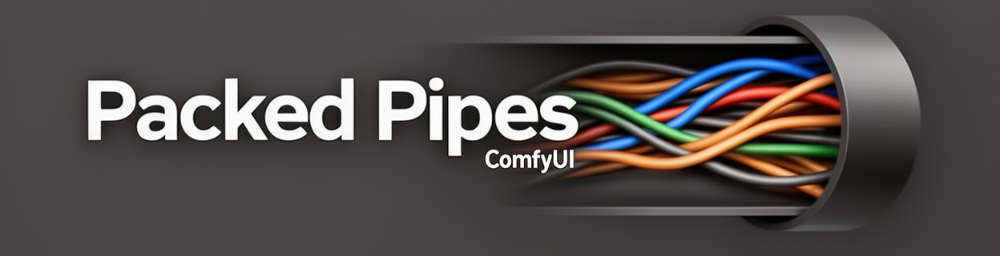
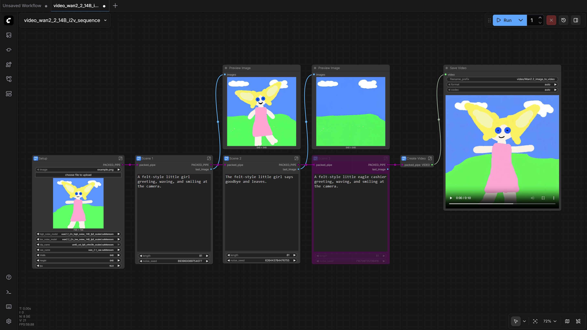

# ComfyUI-PackedPipes



I decided to share my custom nodes that simplify cable management in the ComfyUI workflow. The extension adds two nodes, `Pipe Packer` and `Pipe Unpacker`, to the `utils` category.

* `Pipe Packer` accepts up to 16 connections of any type.
* The `Pipe Unpacker` unpacks all input ports of its `Pipe Packer` into its output ports in the same order.
* Supports rerouters and subgraphs.
* Supports custom output port labels for connected nodes.
* The `Pipe Packer` node supports nested connections from other packers.
* When an input port is connected, the `Pipe Unpacker` node automatically synchronizes with its `Pipe Packer` node.

> [!WARNING]
> Does not support Nodes 2.0 theme.

## Installation

Clone this repository into the `custom_nodes` folder of your ComfyUI installation:
```
git clone https://github.com/id7238/ComfyUI-PackedPipes.git
```

## Examples

### A simple example


### Example of nested Packers and Unpackers


### A complex example

This is an example from a modified Wan 2.2 14B I2V workflow template, modified to sequence scenes to create a video longer than 5 seconds. The last frame is passed to the next scene as the first image. The subgraph of the second scene in the workflow can be duplicated as a subsequent scene. Unused scenes other than the first can be bypassed.

[Download the workflow](./docs/workflows/video_wan2_2_14B_i2v_sequence.json).


[Setup subgraph](./docs/images/workflow_example3-1-setup.png)
| [Scene 1 subgraph](./docs/images/workflow_example3-2-scene1.png)
| [Next Scene subgraph](./docs/images/workflow_example3-3-scene2.png)
| [Create Video subgraph](./docs/images/workflow_example3-4-create_video.png)


